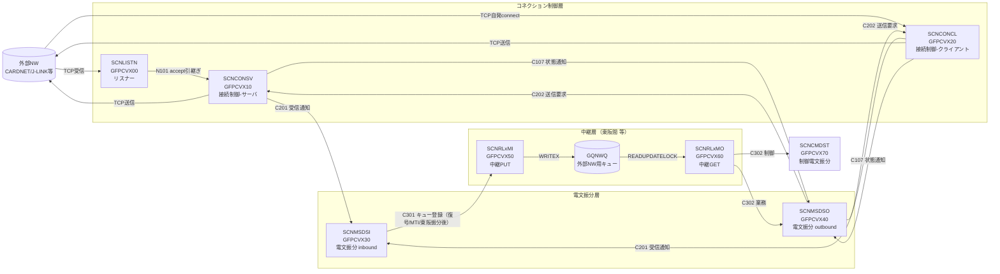
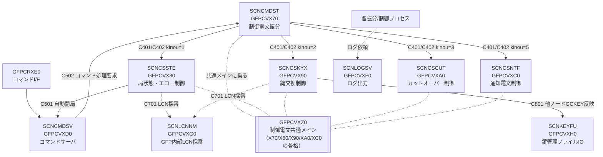

# GFP通信制御 全体フロー・処理可視化

GFP通信制御サブシステム（HP NonStop/Tandem 上のC製ゲートウェイ）の全プロセス（サーバクラス）について、
役割・起動契機・ファイルアクセス（ファイル/キー/操作/位置付け）・電文(IPC)入出力・処理フローを整理したドキュメント。

> 解析対象: `40.ソース/dev/common/src/proc/`（共通テンプレート）＋ `40.ソース/dev/nw_XX/`（NW個別実装）。
> ソースはShift-JIS。本書は12観点の並列ソース解析を統合したもの。

---

## 1. システム全体像

GFPは「外部金融ネットワーク(CARDNET/J-LINK等)」と「内部(東阪2センターの業務系)」の間に立つ**電文中継ゲートウェイ**。
役割の異なる多数のサーバクラスがPathway上で常駐し、IPC電文(`SERVERCLASS_SEND_`=PATHSEND / `$RECEIVE` / `WRITEREADX`)と
キューファイル(GQNWQ)、TMFトランザクションで疎結合に連携する。

### 1-1. データプレーン（業務電文の流れ）

### 1-2. 制御プレーン（開閉局・鍵交換・カットオーバー・通知）

---

## 2. サーバクラス → プログラム 一覧

| サーバクラス | 役割 | プログラム | 入口IPC | 主な連携先 |
|---|---|---|---|---|
| SCNLISTN | リスナー(listen/accept) | GFPCVX00 | $RECEIVE(C103-106,C502)/socket accept | →SCNCONSV(N101) |
| SCNCONSV | コネクション制御(サーバ) | GFPCVX10(11〜17) | N101/C202/C502/socket | →SCNMSDSI(C201), →SCNMSDSO(C107) |
| SCNCONCL | コネクション制御(クライアント) | GFPCVX20(_*) | C202/C502/socket | →SCNMSDSI(C201), →SCNMSDSO(C107/.#CONN) |
| SCNMSDSI | 電文振分(inbound) | GFPCVX30 | C201/C502 | →中継PUT(C301), →LCN採番(C701) |
| SCNMSDSO | 電文振分(outbound) | GFPCVX40 | C302/C202元 | →SCNCONSV/SCNCONCL(C202) |
| SCNRLBMI/CMI | 業務/制御電文中継(in)=PUT | GFPCVX50 | C301/CM | →GQNWQ(WRITEX) |
| SCNRLBMO/CMO | 業務/制御電文中継(out)=GET | GFPCVX60 | GQNWQ駆動 | →SCNMSDSO/SCNCMDST(C302) |
| SCNCMDST | 制御電文振分 | GFPCVX70 | C302/C502 | →各制御サーバ(C401/C402) |
| (共通メイン) | 制御電文共通メイン処理 | GFPCVXZ0 | $RECEIVE | (X70/80/90/A0/C0の骨格) |
| SCNCSSTE | 局状態・エコー制御 | GFPCVX80 | C401/C402 | GCSST更新, →CMD(C501自動開局) |
| SCNCSKYX | 鍵交換制御 | GFPCVX90 | C401/C402 | GCKEY更新, →SCNKEYFU(C801), ATALLA |
| SCNKEYFU | 鍵管理ファイルIO | GFPCVXH0 | C801 | GCKEY更新(他ノード反映) |
| SCNCSCUT | カットオーバー制御 | GFPCVXA0 | C401 | GCCUT更新(NWM_CTU) |
| SCNCSNTF | 通知電文制御 | GFPCVXC0 | C401 | GLMLG/GLELGログ |
| SCNCMDSV | コマンドサーバ | GFPCVXD0 | (調査中) | →各サーバ(C501/C502) |
| SCNLCNNM | GFP内部LCN採番 | GFPCVXG0 | C701 | LCN連番(100〜8191) |
| SCNLOGSV | ログ出力 | GFPCVXF0 | (調査中) | GLNLG/GLELG/GLMLG |
| (コマンドI/F) | コマンドI/F | GFPCRXE0 | TACL/運用 | →SCNCMDSV |

> 他に SCNCSSAF(SAF送信制御), SCNTMRCT(タイマー制御, 二重化), SCNSERNM(システム採番), SCNATLDS(ATALLA振分), SCNOPMTO(運用監視端末出力) 等のサーバクラスが定義されている（制御電文振分やNWM経由で連携）。

---

## 3. 共通ファイル一覧とアクセス・マトリクス

### 3-1. ファイル一覧（論理ID → 物理名 → 内容 → 主キー）

| 論理ID | 物理名 | 内容 | 主キー構成 |
|---|---|---|---|
| GFLIN | FLNGFLIN | 回線管理（コネクション定義） | site+nw+grp+if+station+connect(24)／代替A1=srv_cls(kind8+num4) |
| GCLST | FLNGCLST | 回線ステータス（接続状態/IP/PORT/err） | site+nw+grp+if+station+connect(24) |
| GCSST | FLNGCSST | 局状態管理（開局/閉局 state_sts） | site+nw+grp+if+station+connect(24) |
| GCEST | FLNGCEST | エコー状態管理（last_echo_result） | site+nw+grp+if+station+connect |
| GCCUT | FLNGCCUT | カット対象日付管理 | if+station+connect（管理層単位） |
| GCSCN | FLNGCSCN | 受信コネクション数管理（max/crt） | site+nw+grp+if(+station)(18) |
| GCSAF | FLNGCSAF | SAF送信状態管理 | — |
| GCKEY | FLNGCKEY | 鍵管理（KMAC/KC, 世代01/02, check_digit） | site+nw+grp+if+station+key_type(4) |
| GFNWI | FLNGFNWI | N/W情報（I/F・局・電文項目位置・管理層・タイマ） | site+nw+grp+if+station |
| GFPHI | FLNGFPHI | 物理名情報（SC＋ファイル種別→物理ファイル名解決） | site+nw+grp+srv_cls(kind+num+mlt)+prc_file_kind |
| GFNWS | FLNGFNWS | 接続先固有情報 | nw+if+station+connect（層単位） |
| GFNSW | FLNGFNSW | 東阪振分比率設定 | site+nw+grp |
| GFQSW | FLNGFQSW | 受信電文振分先設定（MTI→宛先SC） | site+nw+grp+mti |
| GFQBK | FLNGFQBK | 送信電文折返し振分先設定 | site+nw+grp+mti |
| GFMTL | FLNGFMTL | 制御電文管理（取引状態/マッチング/タイマ） | part_id+lcn／代替A1=マッチングキー,A2=タイマキー |
| GFELI | FLNGFELI | 制御電文エレメント情報（ISO8583定義） | — |
| GQNWQ | FLNGQNWQ | 外部NW用キュー（中継PUT/GET, FIFO） | RDF/相対キー |
| GLNLG | FLNGLNLG | N/W通信ログ | — |
| GLELG | FLNGLELG | エラー出力ログ | — |
| GLMLG | FLNGLMLG | 制御電文ログ | part_id+lcn+s_h_kubun+send_recv_id |

### 3-2. アクセス・マトリクス（◎=生成/更新, ○=参照, （）=モジュール経由）

| ファイル | X00 | X10 | X20 | X30 | X40 | X50 | X60 | X70 | X80 | X90 | XA0 | XC0 |
|---|---|---|---|---|---|---|---|---|---|---|---|---|
| GFPHI | ○ | ○ | ○ | ○ | ○ | ○ | ○ | ○ | | ○ | ○ | ○ |
| GFNWI | ○ | ○ | ○ | ○ | ○ | ○ | ○ | ○ | ○ | ○ | ○ | ○ |
| GFLIN | ○ | ○ | ○ | | ○ | | | | | | | |
| GCLST | ◎ | ◎ | ◎ | | ○ | | | | | | | |
| GCSCN | ◎ | | | | | | | | | | | |
| GCSST | | | | ○ | ○ | | | | ◎ | ○ | ○ | |
| GCEST | | | | | | | | | ◎ | | | |
| GCKEY | | | | (ENC) | (ENC) | | | | | ◎ | | |
| GFQSW | | | | ○ | | ○ | | ○ | | | | |
| GFNSW | | | | ◎ | | | | | | | | |
| GFQBK | | | | | ○ | ○ | | | | | | |
| GFNWS | | | | | | | | (共通) | ○ | ○ | ○ | |
| GFMTL | | | | | | | | ◎ | | | | |
| GFELI | | | | | | | | ○ | | | | |
| GCCUT | | | | | | | | | | | ◎(CTU) | |
| GQNWQ | | | | | | ◎WRITEX | ◎GET | | | | | |
| GLMLG | | | | | | | | ◎ | ◎ | ◎ | ◎ | ◎ |
| GLELG | | | | ○ | ○ | | ○ | ○ | | | ○ | ○ |

> **重要**: GCSST(局状態)・GCEST・GCSCN・GCSAF を**新規生成(ADD)するオンライン処理は本プロセス群に存在しない**。
> X80(局状態)もXA0(カットオーバー)も GCSST は READ＋UPDATE のみ（XA0はREADのみ＋GCCUT更新）。
> → これらの状態レコードは**初期ロード(マスタ整備/バッチ)で全コネクション分を作成しておく前提**。レコードが無いと送受信時にファイルI/Oエラー(SCAA001, Guardian EOF=1)になる。

---

## 4. IPC電文（プロセス間メッセージ）カタログ

| 電文 | 名称 | 方向(主) |
|---|---|---|
| N101 | コネクション接続通知 | リスナー → 接続制御(サーバ) |
| N102 | コネクション入替・切断指示 | リスナー → 接続制御(サーバ) |
| C103-C106 / R103-106 | 接続開始/完了/切断/入替 要求・応答 | 接続制御 ⇄ リスナー |
| C107 / R107 | コネクション状態通知 | 接続制御 → 電文振分(out) |
| C201 / R201 | 電文受信通知 | 接続制御 → 電文振分(inbound) |
| C202 / R202 | 電文送信要求 | 電文振分(out) → 接続制御 |
| C301 / R301 | キュー登録要求 | 電文振分(in)/制御振分 → 中継PUT |
| C302 / R302 | キュー取出し通知要求 | 中継GET → 電文振分(out)/制御振分 |
| C401 / R401 | NW電文受信要求 | 制御電文振分 → 各制御サーバ |
| C402 / R402 | 制御電文作成要求 | 制御電文振分 → 各制御サーバ(仕向) |
| C501 / R501 | コマンド要求(自動開局等) | 各サーバ → コマンドサーバ |
| C502 / R502 | コマンド処理要求 | コマンドサーバ → 各サーバ |
| C701 / R701 | GFP内部LCN採番 要求・応答 | 各サーバ → LCN採番 |
| C801 / R801 | 鍵管理ファイル更新要求 | 鍵交換制御 → 鍵管理ファイルIO(他ノード) |

---

## 5. プロセス別詳細

### 5-1. GFPCVX00 : リスナー（SCNLISTN）

- **起動契機**: Pathway常駐。`$RECEIVE`(NOWAIT)とTCPソケット(`listen`/`accept_nw`)を `AWAITIOX` で多重待ち。起動時 `GFLIN.listen_status==LISTEN` のポートを復旧。
- **役割**: TCPの listen/accept のみ担当し、確立済ソケットを接続制御(サーバ)へ引き継ぐ（データ送受信はしない）。

| ファイル | 操作 | キー | 位置付け | LOCK | 用途 |
|---|---|---|---|---|---|
| GFLIN | OPEN/SRED/NRED/CLOS | 代替A1=srv_cls(kind8+num4) | EXACT | NOLOCK | 自SCが受持つリスンポート構成を全件ロード |
| GFNWI | OPEN/SRED/CLOS | site+nw+grp(+if/station) | EXACT | NOLOCK | コネクション数管理層(I/S)・種別(A/B)取得 |
| GCLST | OPEN/SRED/UPDT/CLOS | 24桁(全長) | EXACT | 更新時LOCK | 接続状態・IP/PORT・errを反映(TMF配下) |
| GCSCN | OPEN/SRED/UPDT/ULOC/CLOS | site+nw+grp+if(+station)(18) | EXACT | 更新時LOCK | 現接続数 crt の判定/増減(TMF配下) |

- **入出力**: accept成功→**N101**で接続制御(サーバ)へソケット引継ぎ（保留中A001へ即リプライ or キュー）。数オーバー時 kind=A→拒否, kind=B→`LSTN_reconnect_start`(N102で全コネクション再接続)。
- **フロー**: init(GCLST/GCSCN常時OPEN, GFLIN読込) → ポート復旧(socket→bind→listen→accept) → main(AWAITIOX) → accept完了(`LSTN_accept_complete`: アドレスチェック→GCSCN数判定→空きコネクション検索→N101通知→GCSCN +1)。
- **接続拒否(EMS 29116 ACCEPT_REJECT)**: **SCBB001**接続先アドレス不一致 / **SCBB002**コネクション数オーバー(kind=A) / **SCBB004**空きコネクション無し / **SCBB005**全コネクション接続済。

### 5-2. GFPCVX10 : コネクション制御(サーバ)（SCNCONSV）

- **起動契機**: Pathway常駐。`$RECEIVE`(C202/C501/C502, システムメッセージ)、リスナーIPC(N101/N102/R103-106)、Outbound応答(R107)、PATHSEND完了(R201/R501)、ソケットI/O、タイマを `AWAITIOX` で多重処理。
- **役割**: リスナーから引き継いだ**データソケットを自プロセスで保有**し、受信(→inbound振分)と送信(←outbound振分)を実行。GFPCVX11(プロセス管理)/12(ソケット)/13(リスナー連携)/14(inbound振分)/15(outbound連携)/16(コマンド)/17(共通IO)に分割。

| ファイル | 操作 | キー | 位置付け | LOCK | 用途 |
|---|---|---|---|---|---|
| GFPHI | OPEN/SRED/NRED/CLOS | site+nw+grp+srv_cls+prc_file | EXACT/GENERIC | NOLOCK | 起動時のみ。各ファイル物理名・連携SC取得 |
| GFLIN | OPEN/SRED/NRED/CLOS | 代替A1=srv_cls / pri=24桁 | GENERIC | NOLOCK | 自担当コネクション/リスナー定義を構築 |
| GFNWI | (load) | site+nw+grp系 | — | NOLOCK | NW区分・電文長位置・タイマ・リトライ取得 |
| GCLST | OPEN/SRED/UPDT/CLOS | 24桁 | EXACT | 更新時LOCK | コネクション/プロセス状態・IP/port・切断理由更新(TMF) |

- **入出力**: 受信1電文完了→**C201**でinbound振分(SCNMSDSI)へPATHSEND(同時数=CCS_MAX_inbound, 溢れは送信待ちキュー)。送信は**C202**(←SCNMSDSO)のmsg_dataを`send_nw2`。ポートopen/close時に**C107**でoutbound振分へ通知。
- **特記**: 受信バッファは**ゼロコピー流用**（recv時にC201ヘッダ分を空けて受信し、振分時はポインタ調整のみ）。電文長は GFNWI の属性(BIN/BCD/ASCII/EBCDIC)で解析・精査。

### 5-3. GFPCVX20 : コネクション制御(クライアント)（SCNCONCL）

- **起動契機**: Pathway常駐。**単一プロセス内の協調グリーンスレッド**＋`AWAITIOX`単一イベントループ。回線(GFLIN, connect_id=`CC`)毎にtransportスレッドを生成し、自側から`connect_nw`。コマンドC502(OPN/CLS/FL_RE_READ)でも接続制御。
- **役割**: 自発的にTCP接続するクライアント側。スレッド種別=transport/sender/receiver/notif_out_dist/ipc_interface/out_dist_proc。上限 DEF_MAX_THREAD=接続数×3+α。

| ファイル | 操作 | キー | 位置付け | LOCK | 用途 |
|---|---|---|---|---|---|
| GFPHI | OPEN/SRED(+NRED)/CLOS | prc_kind=各物理名 / srv_cls=自/CMDSV/MSDSI/MSDSO | EXACT/GENERIC | NOLOCK | 物理名・連携SC・outbound通知先群(最大100) |
| GFLIN | OPEN/SRED+NRED/CLOS | 代替A1, connect_id=`CC`絞込 | GENERIC | NOLOCK | 自局クライアント回線一覧 |
| GFNWI | OPEN/SRED+NRED/CLOS | site+nw+grp前方一致 | GENERIC | NOLOCK | NW定義(電文長属性等) |
| GCLST | SRED→UPDT | gflin.pri_key(24) | EXACT | LOCK | 接続/切断状態・アドレス・err更新 |

- **入出力**: 受信→**C201**でinbound振分(SCNMSDSI)へPATHSEND。送信←**C202**(SCNMSDSO)。接続/切断毎に**C107**を通知先`PSNMSDSO.#CONN`へ`WRITEREADX`(Fan-out)。設定は二重バッファ(失敗時旧面復元)。
- **特記**: 電文長デコード `BIN/BCD/ASC/EBC`（cmp_trans.c）。BINの3-8byteはホストエンディアン依存で要注意。接続リトライはショート→ロングの2段。

### 5-4. GFPCVX30 : 電文振分(inbound)（SCNMSDSI）

- **起動契機**: Pathway常駐。`$RECEIVE`で **C201**(電文受信通知, ←接続制御)を受信。C502(GFNSW再読込)も処理。処理後必ず正常リプライ。
- **役割**: 受信電文を復号・認証し、MTIで宛先を判定、東阪振分してキュー登録(中継PUT)へ送る。

| ファイル | 操作 | キー | 位置付け | LOCK | 用途 |
|---|---|---|---|---|---|
| GFPHI | OPEN/SRED/NRED | site+nw+grp(7) / 振分先解決はEXACT | GENERIC/EXACT | NOLOCK | PATHMON名・GCSST物理名・鍵ファイル・振分先解決 |
| GFNWI | OPEN/SRED/NRED | site+nw+grp(7) | GENERIC | NOLOCK | 電文項目位置(MTI位置/属性)・管理単位 展開 |
| GFQSW | OPEN/SRED/NRED | site+nw+grp(7) | GENERIC | NOLOCK | MTI→東京/大阪宛先SC・送信種別 を g_detour_tbl[30]へ |
| GFNSW | OPEN/SRED | site+nw+grp | EXACT | NOLOCK | 東阪振分率→sort_list[100]生成 |
| GCSST | OPEN / SRED(電文毎) | site+nw+grp+if+station | EXACT | NOLOCK | 受信局状態取得→ログ/C301へ |
| GCKEY | (NWM_ENC内部) | — | — | — | 復号/MAC認証鍵 |

- **入出力**: 復号/認証(**NWM_ENC**) → MTI取得(**NWM_MTI**) → 振分先判定 → 東阪振分(GFNSWラウンドロビン) → **C301**(キュー登録要求)を東京/大阪の中継PUTへPATHSEND。LCN採番は**C701**(PATHSEND)。
- **主要エラー**: ECCE007(KMAC認証, =先の事例), ECCE006(KC復号), ECCE011-015(ヘッダ/復号/MTI/振分先/東阪)。

### 5-5. GFPCVX40 : 電文振分(outbound)（SCNMSDSO）

- **起動契機**: Pathway常駐。中継GET等からの送信要求(**C302**)を受け、送信先コネクションを選定して接続制御へ**C202**送信。起動時にGFPHIで各物理名解決。
- **役割**: 送信先コネクション選択（GFLINで一覧化→GCSST局状態判定→ラウンドロビン）＋暗号化/MAC付与(NWM_ENC)。

| ファイル | 操作 | キー | 位置付け | LOCK | 用途 |
|---|---|---|---|---|---|
| GFPHI | OPEN/SRED/NRED | srv_cls+prc_file_kind | GENERIC/EXACT | NOLOCK | 物理名(GCSST/GFLIN/GFQBK等)解決 |
| GFLIN | OPEN/SRED/NRED | 自グループ全件(pri先頭一致) | GENERIC | NOLOCK | コネクション一覧(g_con_list)構築 |
| GCSST | OPEN / SRED(接続毎) | site+nw+grp+if+station+connect(24) | EXACT | NOLOCK | 送信先候補の局状態判定(MDSO_station_sts_read) |
| GCLST | OPEN/SRED | 24桁 | EXACT | NOLOCK | 回線状態参照 |
| GFQBK | OPEN/SRED/NRED | site+nw+grp+mti | GENERIC | NOLOCK | 送信電文折返し振分先設定 |
| GFNWI | OPEN/SRED/NRED | site+nw+grp | GENERIC | NOLOCK | NW情報 |

- **入出力**:
  - **C302**(キュー取出し, ←中継GET) = 主たる送信契機。
  - **C107**(コネクション状態通知, ←接続制御) でメモリ上の `g_con_list.connection_st` を更新（=どの接続が「接続中」かを把握）。
  - **C502**(コマンド `FL_RE_READ`) で接続構成再読込。
  - `MDSO_send_judge`で送信先決定（接続中＋局状態OK＋ラウンドロビン）→**C202**で接続制御(SCNCONSV/SCNCONCL)へPATHSEND→**R202**判定。
  - 送信不可時は **C301**(データ種別`09`=送信不可応答)を GFQBK で求めた折返し先へPATHSEND。
- **主要エラー**: **SCAA001 ファイルI/Oエラー**（GCSST等のEXACT読込失敗。`@E`=Guardian生エラー番号。**1=EOF=該当キーのレコード無し**）。`MDSO_station_sts_read` は GCSST の EOF を「想定外＝障害」として送信先選定を中断（黙過しない）。
  - **先の事例(FISC CS0002)との関係**: C107で `connection_st=接続中` と認識した接続でも、GCSST(局状態)にレコードが無ければここで SCAA001(EOF=1) になる。＝「接続(TCP)はあるが局状態レコード未整備」の不整合がここで顕在化する。

### 5-6. GFPCVX50 : 電文中継(PUT)（SCNRLBMI/CMI）

- **起動契機**: Pathway常駐。**$RECEIVE待ち受け(同期REPLY型)**。上流(振分in/制御振分)から **C301**(キュー登録要求)またはCMタイムアウトIPCを受け、外部NW用キュー(GQNWQ)へ書込む。
- **役割**: 入口側集約。受信電文をキューファイルへ **WRITEX(PUT)**（複数キューにラウンドロビン+リトライ）。

| ファイル | 操作 | キー | 位置付け | LOCK | 用途 |
|---|---|---|---|---|---|
| GFPHI | OPEN/SRED/NRED/CLOS | srv_cls+prc_file_kind=FLNGQNWQ | GENERIC | NOLOCK | 自SCのキューファイル名を全件取得(最大30) |
| GFNWI | OPEN/SRED/CLOS | site+nw+grp+if/station=`}` | EXACT | NOLOCK | NW区分(EMS用) |
| GQNWQ | OPEN/**WRITEX**/CLOS | RDF/相対(FIFO) | — | **TMF配下** | 電文をキューへ書込(中継本体) |

- **入出力**: C301データ部→GQNWQへWRITEX→**R301**応答。書込は COM_TMF(BT→WRITEX→END)。失敗時は次キューへリトライ。

### 5-7. GFPCVX60 : 電文中継(GET)（SCNRLBMO/CMO）

- **起動契機**: Pathway常駐。**キュー駆動ポーリング型**。GQNWQを`READUPDATELOCKX`で待ち、電文が入る(orタイマ満了)と起動して取出し→下流(振分)へPATHSEND中継。
- **役割**: 出口側払い出し。GQNWQから**GET(READUPDATELOCK)**→PATHSEND成功で**END(削除)**/失敗で**ABORT(復元・再取得)**。

| ファイル | 操作 | キー | 位置付け | LOCK | 用途 |
|---|---|---|---|---|---|
| GFPHI | OPEN/SRED | 自SC=GQNWQ名 / SCNCMDST or SCNMSDSO=PATHSEND先 | EXACT | NOLOCK | 読むキュー名・中継先SCを取得 |
| GFNWI | OPEN/SRED/CLOS | site+nw+grp+if/station=`}` | EXACT | NOLOCK | nw_kubun(EMS用) |
| GQNWQ | OPEN(+SETMODE128)/**READUPDATELOCKX**/CLOS | FIFO | — | LOCK+TMF | 電文取出し(中継本体) |
| GLELG | (COM_ERL)WRITE | — | — | — | 送信期限切れ電文の破棄ログ |

- **入出力**: 取出し→**C302**を `COM_PSD` で振分(SCNMSDSO=業務 / SCNCMDST=制御)へ。R302 error=0で ENDTRANSACTION、異常はDELAY後ABORT。期限切れ(expiry_second超)は GLELG へlog後破棄(EMS29300/SCCH001)。
- **特記**: TMF+READUPDATELOCKで**重複なし・欠落なし**の確実配送。FIFO順=登録順を維持。

### 5-8. GFPCVX70 : 制御電文振分（SCNCMDST）

- **起動契機**: 制御電文共通メイン(GFPCVXZ0)の$RECEIVEループ上で動作。**C302**(キュー取出し=被仕向/仕向応答/通知)と**C502**(コマンド=仕向起点)を受ける。
- **役割**: 制御電文を種別(kinou_kbn)ごとの制御サーバへ振り分け、要求/応答マッチング(GFMTL)を管理する「ハブ」。

| ファイル | 操作 | キー | 位置付け | LOCK | 用途 |
|---|---|---|---|---|---|
| GFPHI | OPEN/SRED/CLOS | srv_cls+prc_file_key | EXACT | NOLOCK | 物理名＋各制御SCのSC名/PATHMON取得 |
| GFQSW | OPEN/SRED/CLOS | site+nw+grp+mti=`ZZZZ` | EXACT | NOLOCK | 業務中継(in)SCの論理ID取得 |
| GFELI | (OPEN→)READ | — | — | — | ISO8583エレメント情報(固定フォーマット定義) |
| GFNWI | SRED | site+nw+grp+if+station(IF単位は`}`) | EXACT | NOLOCK | MTI/電文/ビットマップ位置・タイマ・管理層 |
| GFMTL | ADD/SRED/UPDT/ULOC | pri=part_id+lcn / 代替A1=マッチングキー, A2=タイマキー | EXACT/GENERIC | ADD=NOLOCK,SRED=LOCK,UPDT=LOCKFREE | 取引状態管理・要求応答突合・タイムアウト |

- **入出力(振分先)**: kinou_kbn= 1→SCNCSSTE / 2→SCNCSKYX / 3→SCNCSCUT / 4→SCNCSSAF / 5→SCNCSNTF。受信系=**C401**、コマンド仕向=**C402**。応答電文は送信キュー編集→**C301**で制御電文IF(out)/業務中継(in)へ。
- **特記**: MTI先頭スペース→通知固定。仕向応答受信は**NWM_MKM**でマッチングキー生成→GFMTL代替A1でSRED突合(EOFはマッチングエラー)。タイマ制御(SCNTMRCT)へ応答待ちタイマ発行。

### 5-9. GFPCVXZ0 : 制御電文共通メイン処理

- **位置づけ**: 特定SCを持たない**共通骨格**。`main()`＋`CMIN_*`関数群を提供し、制御系各SC(X70/X80/X90/XA0/XC0/SSAF)が同じ枠にリンクして実体化。
- **役割**: 初期化→`$RECEIVE`受信→個別電文処理(`CMIN_handle_req_msg`、個別部が実装)→リプライ→終了 の土台。IPC種別/MTIは解釈せず（$RECEIVE層: 業務電文/システムメッセージ/異常 の判定のみ）。

| ファイル | 操作 | 用途 |
|---|---|---|
| GFPHI | OPEN/SRED/CLOS | 共通物理名解決 |
| GFNWI | OPEN/SRED/CLOS | グループ単位NW情報ロード(g_gfnwi_tbl) |
| GFNWS | SRED | 接続先固有情報読込(共通I/F `CMIN_read_gfnws`) |
| GLMLG | SRED/ADD/UPDT/ULOC | 制御電文ログCRUD(共通I/F、各制御SCが利用) |
| GLELG | OPEN/CLOS | エラーログ制御(COM_ERL) |

- **提供フック**: `CMIN_kbt_set_prgid/init/get_physical_names/file_open/file_close`, `CMIN_handle_req_msg`(個別実装), `CMIN_send_reply`, `CMIN_message_output`, `CMIN_abend`, `NWM_CTU_INIT`(カット日付), `COM_STP`(停止判定)。

### 5-10. GFPCVX80 : 局状態・エコー制御（SCNCSSTE）

- **起動契機**: 共通メイン上。**C401**(NW電文受信: 被仕向要求/仕向応答)・**C402**(自局発仕向要求=コマンド契機)。request_kind×ctl_text_kbn(開局1/閉局2/エコー3)で分岐。
- **役割**: 開局/閉局/エコーの局状態(GCSST)を一元管理(read-modify-write)。

| ファイル | 操作 | キー | 位置付け | LOCK | 用途 |
|---|---|---|---|---|---|
| GCSST | SRED→UPDT中心（**ADDなし**） | 24桁(管理層でstation/connectまで) | EXACT | 開閉局READ=LOCK/エコーREAD=NOLOCK, UPDT=LOCKFREE | 局状態 state_sts 読込・更新 |
| GCEST | SRED(LOCK)→UPDT | 24桁(エコー管理層) | EXACT | LOCK/LOCKFREE | last_echo_result等更新 |
| GFNWI | SRED | site+nw+grp+if(+station) | EXACT | NOLOCK | 管理層・自動開局要否 |
| GFNWS | SRED(最大4層) | nw+if+station+connect | EXACT | NOLOCK | 精査・編集用固有情報 |
| GLMLG | ADD/SRED/UPDT | part_id+lcn+s_h_kubun+send_recv_id | EXACT | put=NOLOCK | 送受信制御電文ログ・突合 |

- **入出力**: **R401/R402**応答。自動開局成立時 **C501**(コマンド要求)をコマンドサーバへPATHSEND。IF単位管理時は**相手サイト(TKY⇔OSK)のGCSSTもUPDATE**(東西二重化)。
- **特記**: state_sts= 10開局/90閉局/11開局処理中/91閉局処理中。遷移判定は**NWM_STE**が`new_stn_sts`で返し`CSTE_update_gcsst`が反映(空白なら更新せずUNLOCK)。**全READでEOF(レコード無)は異常(FILE_IO_ERR)扱い＝事前生成前提**。EMS29214局状態変更/29222局状態エラー。

### 5-11. GFPCVX90 : 鍵交換制御（SCNCSKYX）／ GFPCVXH0 : 鍵管理ファイルIO（SCNKEYFU）

- **GFPCVX90 起動契機**: 共通メイン上。**C401**(接続先契機)/**C402**(GFP自局契機)。control_kind×request_kindで分岐。
- **役割**: 鍵生成/暗号/復号をATALLA(HSM)へPATHSEND依頼し、GCKEYの鍵世代を更新。**NWM_KYX**で精査・編集。

| ファイル | 操作 | キー | 位置付け | LOCK | 用途 |
|---|---|---|---|---|---|
| GFNWI/GFNWS | SRED | グループ/IF/局/接続単位 | EXACT | NOLOCK | 鍵交換管理単位・精査入力 |
| GCSST | SRED | site+nw+grp+if(+station+connect) | EXACT | NOLOCK | 局状態(開局チェック, 参照のみ) |
| GCKEY | SRED→UPDT | site+nw+grp+if+station+key_type(4) | EXACT | 参照NOLOCK/更新前LOCK→LOCKFREE | 現用鍵読込・新鍵書込 |
| GLMLG | ADD/SRED/UPDT | — | — | LOCK/LOCKFREE | 制御電文ログ |

- **入出力**: ATALLAへ`CKYX_atalla_pathsend`。**R401/R402**応答。GCKEY更新後、**他ノード**へ**C801**(`SCNKEYFU`=GFPCVXH0)で反映。LCN採番C701も使用。
- **鍵世代**: レコード内`new_key_index`(01/02)が現用面。更新時は**現用でない面**に新鍵/check_digitを書いてindex反転。被仕向受信=index切替あり/GFP送信=据置。KMAC/KC(4byte)。
- **GFPCVXH0(SCNKEYFU)**: **C801**のみ受理(呼元=X90)。受信レコードを pri_key(key_type含む)でGCKEY READ(LOCK)→そのままREWRITE(LOCKFREE)。最大2件(自/他サイト)。**鍵世代判断はせず**、X90が編集済みのレコードを確定反映するだけ。**R801**応答。

### 5-12. GFPCVXA0 : カットオーバー制御（SCNCSCUT）／ GFPCVXC0 : 通知電文制御（SCNCSNTF）

- **GFPCVXA0 起動契機**: 共通メイン上。**C401**(カットオーバー要求電文)。
- **役割**: 局状態を確認し、**カット対象日付(GCCUT)を更新**(`NWM_CTU_UPDATE`)。

| ファイル | 操作 | キー | 位置付け | LOCK | 用途 |
|---|---|---|---|---|---|
| GFNWI/GFNWS | SRED | 各単位 | EXACT | NOLOCK | NW情報・固有情報 |
| GCSST | **SREDのみ** | site+nw+grp+if(+station/connect) | EXACT | NOLOCK | 局状態(カット可否判定の入力, 参照のみ) |
| GCCUT | UPDATE(NWM_CTU経由) | if+station+connect(管理層) | — | — | カット日付の実体更新(本処理の主目的) |
| GLMLG | ADD/UPDT | — | — | — | 制御電文ログ |

- **重要**: A0は **GCSSTをREADするのみ**で ADD/初期化しない。GCSST/GCEST/GCSCN/GCSAFの**新規生成は本プログラムに存在しない**（カットオーバー≠局状態レコード生成）。
- **GFPCVXC0(SCNCSNTF)**: **C401**(通知電文)。NWM_NTCで精査(1通知/2要求/3応答/9異常)→GLMLG(ADD/UPDT)・GLELG記録、要求型は応答電文編集して**R401**返送。局状態系ファイルには触れない。

### 5-13. 支援層：コマンド／LCN採番／ログ出力

#### GFPCVXD0 : コマンドサーバ（SCNCMDSV）
- **起動契機**: Pathway常駐。`$RECEIVE`で **C501**(コマンド要求, ←コマンドI/F GFPCRXE0や運用端末)を受け、配下サーバへ転送・集約する集約点。
- **ファイル**: 起動時 GFPHI/GFLIN/GFNWI をメモリ展開（物理名・コネクション→SC対応・管理階層）。照会系で GCLST(回線状態)/GCSST(局状態)/GCEST(エコー状態) を EXACT 参照。

| ファイル | 操作 | キー | 位置付け | 用途 |
|---|---|---|---|---|
| GFPHI | OPEN/SRED/NRED | srv_cls種別+番号+prc | EXACT/GENERIC | 物理名・SC名(東阪) |
| GFLIN | OPEN/SRED/NRED | 24桁 | GENERIC | コネクション→送信先SC対応 |
| GFNWI | OPEN/SRED/NRED | site+nw+grp+(if)+station | GENERIC | 管理階層(開局/閉局/エコー/鍵交換) |
| GCLST/GCSST/GCEST | OPEN/SRED | 24桁 | EXACT | 状態照会(STATUS_TCP/SERVICE/ECHO) |

- **入出力**: 解釈したコマンドを `COM_PSD` で配下SC(コネクション制御/制御電文振分/ログ出力)へ **C502**(コマンド処理要求)転送→集約→**R501**で要求元へ応答。コマンドは4桁コード(1010 OPEN/1020 CLOSE/1031-1032 LISTEN/2010系 開局/2020系 閉局/2110 ECHO/2210-2220 鍵交換/3010 ログ切替/4010-4012 ファイル再読込)。

#### GFPCRXE0 : コマンドI/F
- **位置づけ**: **常駐せずTACLから都度起動される一過性プロセス**（$RECEIVEループ無し）。入力テキストコマンドを構造化IPCに変換し、コマンドサーバ(SCNCMDSV)へ中継する入口。
- **入力**: プロンプト対話(stdin) または INファイル(TACLスタートアップ指定)を行読込。書式 `COMMAND site-nw-grp[-if[-st[-cn]]] [opt]`。19種(TCP_OPEN/CLOSE/LISTEN/STATUS_TCP, SIGN_ON/OFF, STATUS_SERVICE, ECHO/STATUS_ECHO, KEY_REQUEST/KEY_PUSH, LOG_ROTATE, RELOAD_GFLIN/GFNSW, EXIT/HELP/DELAY 等)。
- **ファイル**: GFPHI(SRED, SC種別="CMDSV")でコマンドサーバのPATHMON/SC名取得のみ（業務I/Oなし）。
- **入出力**: `COM_PSD`で SCNCMDSV へ **C501**(command_name=4桁コード)送信→**R501**受信→照会系は整形して標準出力、実行系は SUCCESS/FAIL 表示。

#### GFPCVXG0 : GFP内部LCN採番（SCNLCNNM）
- **起動契機**: Pathway常駐。`$RECEIVE`で **C701**(LCN採番要求, ←電文振分inbound等)を受け、連番LCNを採番して **R701** で返す。**起動時に1/100秒DELAY**(再起動時のLCNユニーク性担保)。
- **ファイル**: GFPHI(SRED/NRED, GENERIC)で起動時に**採番範囲 `lcn_num_scope.min/max`** を取得するのみ。**連番はメモリ(`g_myinfo.seqnum`)保持でファイル書込なし**。

| ファイル | 操作 | キー | 位置付け | 用途 |
|---|---|---|---|---|
| GFPHI | OPEN/SRED/NRED/CLOS | srv_cls+prc_file種別(=GFP_LCN)+番号+mlt | GENERIC | LCN採番範囲取得 |

- **LCN構成**: 採番システム＋場所＋年＋MDH＋MMSS＋連番。連番は `(1/100秒CC<<13 | seqnum)` を5bit区切り32進数(0-9A-V)で表現。**採番範囲はGFPHIの `lcn_num_scope` 設定値**（ソース上の境界定数は `SEQNUM_MIN=0`〜`MAX=8191`。※「下限100」は環境設定次第で、コード定数の下限は0）。`seqnum==max` で `min` に戻り循環(ラップ)。

#### GFPCVXF0 : ログ出力（SCNLOGSV）
- **起動契機**: Pathway常駐。`$RECEIVE`で電文振分からのログ出力要求(`LG_OUT_REQ_DEN_REQ`)、コマンドサーバからのログ切替(C502 "3010")を受ける。
- **役割**: **N/W通信ログ(GLNLG)専用**の書込サーバ（GLELG/GLMLGは他PG）。前日/当日/翌日＋指定の4面を管理。

| ファイル | 操作 | キー | 位置付け | LOCK | 用途 |
|---|---|---|---|---|---|
| GFPHI | OPEN/SRED/NRED/CLOS | srv_cls(全`}`)+prc=NW_LOG+"DT" | GENERIC | NOLOCK | NW通信ログ物理名31世代を展開 |
| GLNLG | OPEN/ADD/SRED(LOCK)/UPDT/CLOS | pri=通信電文ID(time_stamp等) | EXACT | ADD/更新時LOCK | ログ登録(ADD)・更新(SRED+UPDT)。**COM_TMF配下** |

- **入出力**: 登録/更新は COM_TMF(BEGIN/END/ABORT)。応答 **R601**(PKEY重複時はLCN＋東阪振分kbnを返す)。翌日面ヒットで日替わり処理(面シフト)、"3010"でログファイル切替(EVT_LOG_FILE_CHANGE)。

---

## 6. 個別モジュール層（NWM_* / COM_*）

各procから呼ばれる部品。`common`がIF定義＋デフォルト/ダミー実装、`nw_XX`がNW固有実装(GFPCS&lt;NW&gt;**, 7文字目=NW識別子 J=CA/L=JL/D=DI/U=UP/V=VI/B=BK/A=AX/N=NY)。

### NWM_*（NW個別モジュール）

| モジュール | 役割 | 触る共通ファイル | 戻り値要点 |
|---|---|---|---|
| NWM_ENC | 暗号化/復号・MAC生成/検証(ATALLA PATHSEND) | GCKEY(KMAC/KC) | 0正常/1変換なし/2認証NG/3桁/4ATALLA/5IO/6param/7KMAC鍵/8KC鍵/9,10桁(KMAC/KC) |
| NWM_ENI | ENC/鍵交換の初期化(ATALLA振分・GCKEY open) | GCKEY(open),GFPHI | 0/-1 |
| NWM_KYX | 鍵交換(精査/編集/局状態 各req/rsp) | GCKEY,GCCUT,GFNWI | 0正常/1拒否/2障害通知/3破棄/9異常 |
| NWM_HDE/HDL | 電文ヘッダ編集/電文長編集 | なし | HDE:void / HDL:0正常,9エラー |
| NWM_MTI | 電文種別(MTI)取得 | なし | 1一般/2リジェクト/3HB/4アイドル/-1不正 |
| NWM_MSJ | 電文種別判定 | なし | 0正常/1エラー |
| NWM_MKM | 要求応答マッチングキー生成 | なし | 0正常/1エラー |
| NWM_NTC | 通知電文 精査/編集 | GFNWI | check:1通知/2要求/3応答/9異常 |
| NWM_NTE | 送信時局状態判定 | 局状態(引数) | 1送信可/0不可/2種別異常/3局状態異常 |
| NWM_CTO/CTU | カットオーバー電文 精査・編集 / カット日付 INIT・GET・UPDATE | GCCUT,GFPHI | short(0系正常/異常) |
| NWM_STE | 開局/閉局/エコー(局状態)制御 | GCSST,GCCUT,GFNWI | 精査0/1/2/3 ほか更新有無 |

### COM_*（共通基盤 comlib）

| モジュール | GFPCGX | 役割 |
|---|---|---|
| COM_IOM | B0 | **ファイルIO抽象**(下記) |
| COM_PSD / COM_PSD_SYS | 40 / H0 | PATHSEND(通常 / システム採番二重化) |
| COM_SDT | 50 | システム日時取得(1標準/2日本/3中国) |
| COM_UNQ | 90 | ユニーク日時(一意採番) |
| COM_TMF | A0 | トランザクション(BT/ET/AT/RT/GTID) |
| COM_STP | C0 | プロセス停止判定 |
| COM_ERL | 80 | エラーログ編集出力(SCAA001/002) |
| COM_TGM/TGA | 60 | IOタグ生成/解析 |
| COM_ASN / COM_DTC / (procinfo) | D0/E0/G0 | ASSIGN取得 / タイムアウト時刻算出 / プロセス情報 |
| (BITMAP) | 20 | ISO8583 ビットマップ展開・組立 |

### COM_IOM 詳細

- シグネチャ: `COM_IOM(func_type, sub_status, arg3(trace), arg4(file), arg5(in:key/位置付け/lock), arg6(out:guardian_errcode/rec))`。
- 機能コード: `OPEN`/`SRED`(STARTREAD=FILE_SETKEY_→READX)/`NRED`(NEXTREAD)/`ADD `(WRITEX)/`UPDT`(WRITEUPDATE)/`DELT`/`ULOC`(UNLOCKREC)/`CLOS`。
- 位置付け: `APPROXIMATE=0`(近似)/`GENERIC=1`(前方一致)/`EXACT=2`(完全一致)。key_type=主PRI"10"/代替A1〜A9。lock_flg=NOLOCK/LOCK/LOCKFREE。
- **エラー2段**: `sub_status`= "00"正常 / Z1オープン / **Z2=EOF** / Z3 READ / Z4 WRITE / Z5タイムアウト / Z6ディスクフル / Z7重複 / Z9その他。`guardian_errcode`= Guardian生番号(**1=EOF**, 10=重複, 40=timeout, 43=discfull)。関数戻り 0正常/1 IOエラー/-1 パラメータ不正。

---

## 7. 横断トピック

### 7-1. 局状態(GCSST)レコードはどこで作られるか
- **オンライン処理での生成(ADD)は無い**。X80(局状態)もXA0(カットオーバー)も READ＋UPDATE のみ。
- → GCSST/GCEST/GCSCN等は**初期ロード(マスタ整備)で全コネクション分を作成しておく前提**。
- レコードが無いと: 送受信時(X30/X40)に**SCAA001(Guardian EOF=1)**、開局時(X80)もEOFを異常扱い。＝接続(TCP)はできても電文の送受信・開局はできない。

### 7-2. 東阪(East/West)振分と二重化
- GFNSW(振分比率)→sort_list[100]のラウンドロビンで東京(TKY)/大阪(OSK)を選択(X30)。エラー時は逆サイトへ迂回再送。
- 局状態(GCSST)はIF単位管理時、自サイト更新後に**相手サイトのレコードも更新**(X80)。鍵(GCKEY)も自/他サイト両方を更新し他ノードへC801波及(X90→XH0)。

### 7-3. TMFトランザクション
- GCLST更新(X00/X10/X20)、GCSCN増減(X00)、GQNWQのPUT/GET(X50/X60)は **COM_TMF(BEGIN→IO→END/ABORT)** で保護。中継GETは失敗時ABORTで電文を復元し重複・欠落を防止。

### 7-4. コネクション上限の三層
1. **コード天井**(`limit.h`): CCS/CCC_MAX_connection=200, LSN_MAX_ports=200 等(要ビルド)。
2. **物理枠**(GFLIN): コネクション定義レコード(1 I/Fあたり CL+CS×n)。
3. **実効キャップ**(GCSCN `max_connect_num`): リスナーが accept 時に `crt≥max` で SCBB002 拒否。
